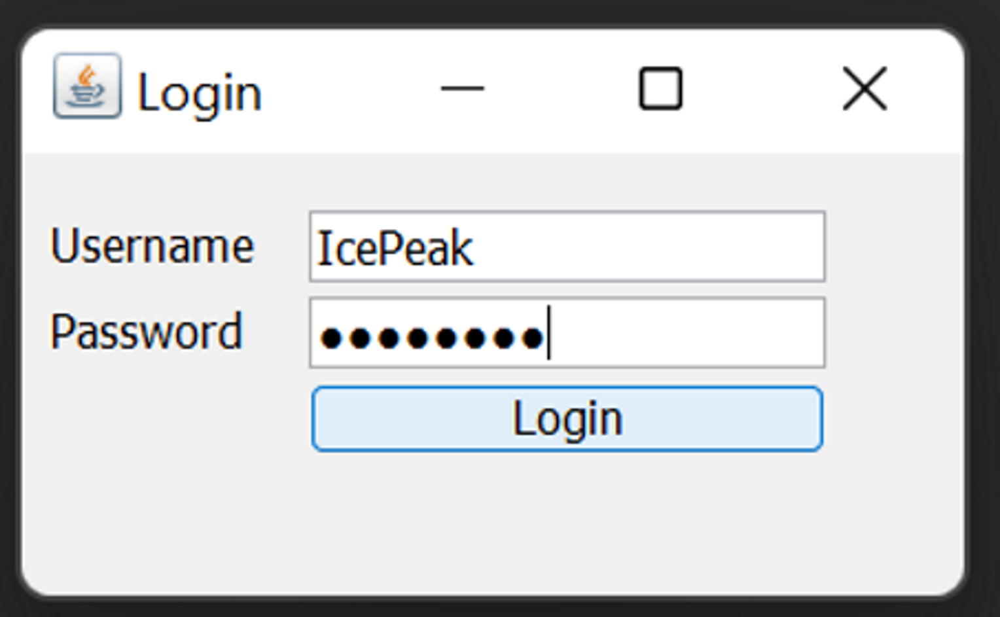
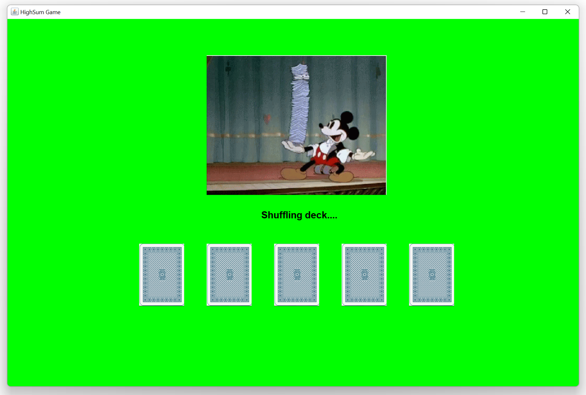
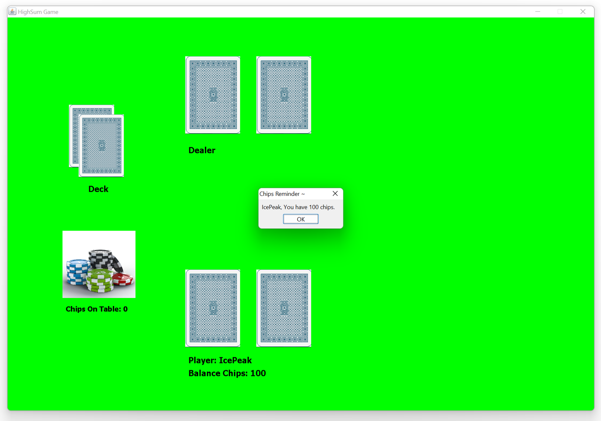
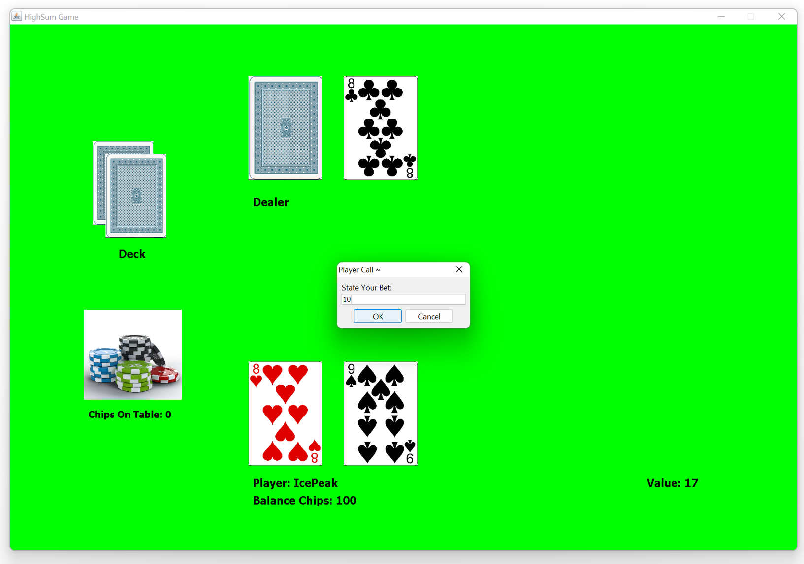
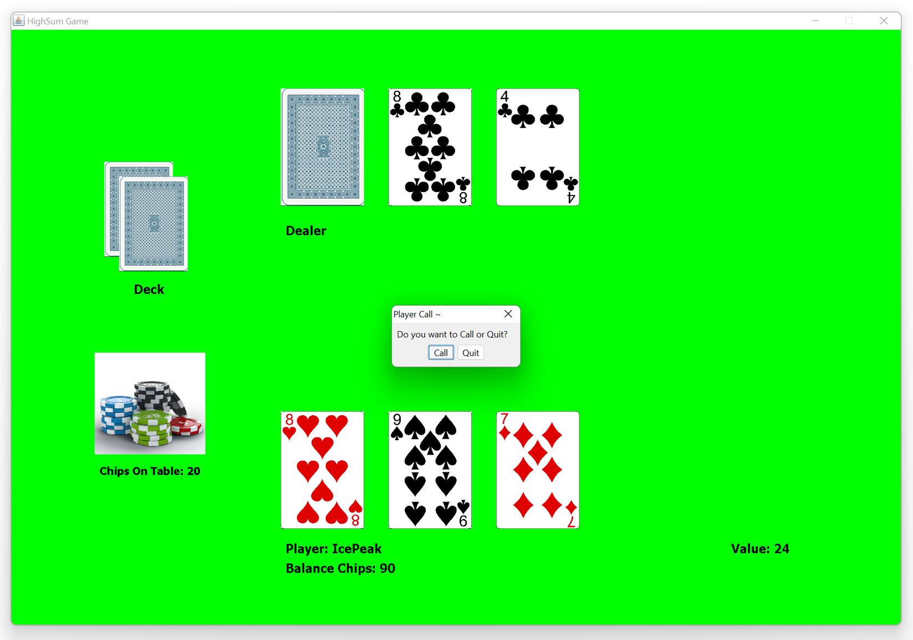
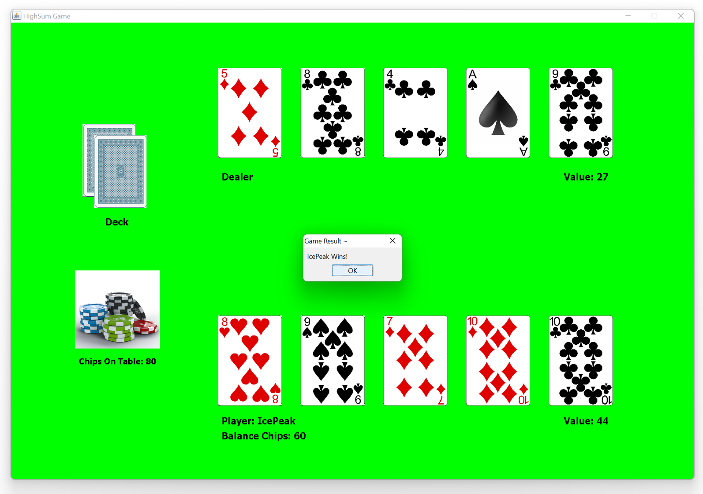

  <h1>HighSum Game</h1>

 

## Description
HighSum is a Java-based GUI card game where a single player competes against a computer dealer in a strategic betting game. 
The game begins with both the player and dealer receiving two cards each, with one of the dealer's cards remaining hidden. 
The player with the higher-value last card gets to "Call" the game by placing a bet, while the other player can choose to "Follow" (10 bet) or "Quit" the round. 
The game continues for a maximum of four rounds, with players alternating who gets to call based on their last card values. 
At the end of all rounds, the player with the highest total card sum wins all the chips on the table. 
Players start with 100 chips and must manage their betting strategy carefully, as running out of chips ends the game. 
The game features a complete GUI interface with login authentication, card shuffling animations, and comprehensive error handling for invalid inputs and insufficient funds.

 

## Login
<li>Username: IcePeak</li>
<li>Password: password</li>

  

 

## Shuffle Deck

  

 

## Start Game

  

 

### State Bet

  

 

### Call or Quit

  

 

### Win!

  

 

### Calculator

  

 

